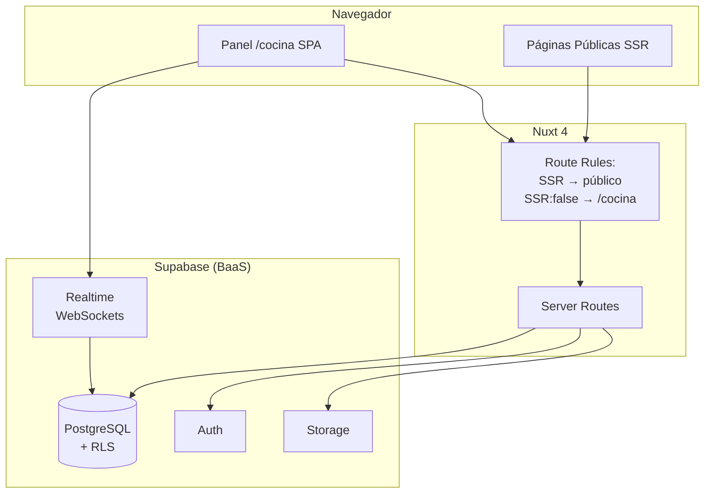
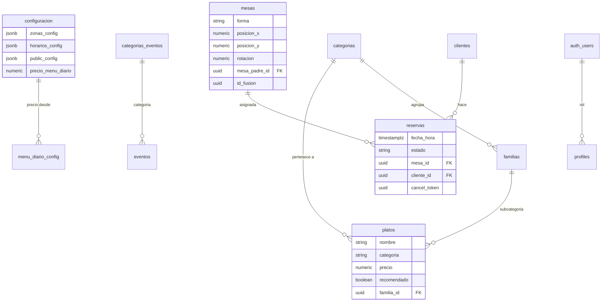

# Plataforma Web Integral para Restaurante La Zíngara

Trabajo Final de Máster

**Pablo García Fernández**

Máster en Desarrollo con IA — BIGSchool

Tutor: Mouredev

<!--
Buenos días/tardes. Hoy presento mi Trabajo Final de Máster: una plataforma web integral para el Restaurante La Zíngara, en Santa María del Páramo, León.
-->

---
layout: center
---

# Índice

<div v-click="1" class="text-lg">

1. Contexto y Motivación
2. Objetivos del Proyecto
3. Arquitectura del Sistema
4. Stack Tecnológico
</div>

<div v-click="2" class="text-lg mt-4">

5. Fase 1 — Escaparate Digital
6. Fase 2 — Panel de Gestión
7. Fase 3 — Motor de Mesas Interactivo
</div>

<div v-click="3" class="text-lg mt-4">

8. Modelo de Datos
9. Decisiones Técnicas Clave
10. Seguridad y Calidad
11. Testing
</div>

<div v-click="4" class="text-lg mt-4">

12. Demo
13. Conclusiones y Trabajo Futuro
</div>

<!--
Vamos a recorrer desde el problema inicial hasta la solución implementada en tres fases, viendo las decisiones técnicas más importantes.
-->

---
layout: two-cols
---

# Contexto

**La Zíngara** — Santa María del Páramo, León

::right::

<v-clicks>

### Problema detectado

- Gestión de reservas manual (papel/teléfono)
- Sin presencia digital actualizada
- Carta y menú del día en PDF estático
- Plano de mesas en papel — sin control de aforo
- Procesos desconectados: reserva, cocina, eventos

### Oportunidad

- Digitalizar la experiencia completa del cliente
- Unificar frontend público + backend de gestión
- Diferenciación competitiva en hostelería rural

</v-clicks>

<!--
El restaurante La Zíngara operaba completamente en analógico. Las reservas se apuntaban en papel, la carta se actualizaba cada varios meses porque implicaba reimprimir. Este proyecto nace de la necesidad de digitalizar la operación completa.
-->

---
layout: center
class: text-center
---

# Objetivos del Proyecto

<div class="grid grid-cols-2 gap-6 mt-8 text-left">

<div v-click class="p-4 rounded-xl bg-orange-50 border border-orange-200">
<carbon:overflow-menu-vertical class="text-orange-600 text-2xl mb-2"/>
**Escaparate digital** público con carta, menú diario y eventos
</div>

<div v-click class="p-4 rounded-xl bg-amber-50 border border-amber-200">
<carbon:calendar class="text-amber-600 text-2xl mb-2"/>
**Sistema de reservas** online con selección de zona/mesa
</div>

<div v-click class="p-4 rounded-xl bg-yellow-50 border border-yellow-200">
<carbon:settings class="text-yellow-600 text-2xl mb-2"/>
**Panel de administración** para gestión de contenido
</div>

<div v-click class="p-4 rounded-xl bg-emerald-50 border border-emerald-200">
<carbon:edit class="text-emerald-600 text-2xl mb-2"/>
**Editor interactivo** de plano de mesas (Konva.js)
</div>

<div v-click class="p-4 rounded-xl bg-teal-50 border border-teal-200">
<carbon:intersect class="text-teal-600 text-2xl mb-2"/>
**Fusión inteligente** de mesas y control de aforo
</div>

<div v-click class="p-4 rounded-xl bg-sky-50 border border-sky-200">
<carbon:wifi class="text-sky-600 text-2xl mb-2"/>
**Sincronización en vivo** vía WebSockets (Realtime)
</div>

</div>

<!--
El objetivo no era solo tener una web — eso es trivial hoy. El objetivo era construir un ecosistema completo donde la experiencia del cliente y la gestión interna estuvieran unificadas.
-->

---

# Arquitectura del Sistema



<div class="flex justify-around mt-4 text-sm">

<div v-click class="px-4 py-2 bg-blue-100 rounded-lg font-bold">
SSR Público → SEO
</div>

<div v-click class="px-4 py-2 bg-purple-100 rounded-lg font-bold">
SPA Protegido → Auth
</div>

<div v-click class="px-4 py-2 bg-green-100 rounded-lg font-bold">
Realtime → WebSockets
</div>

</div>

<!--
Arquitectura deliberadamente simple pero potente. Nuxt 4 nos da SSR para SEO en páginas públicas y modo SPA para el panel admin. Supabase como BaaS cubre base de datos, auth, storage y WebSockets. Sin backend propio — todo PostgreSQL con RLS.
-->

---

# Stack Tecnológico

| Capa | Tecnología | Por qué |
|------|-----------|---------|
| **Frontend** | Nuxt 4 (Vue 3 + TypeScript) | SSR + SPA en un mismo framework |
| **Estilos** | Tailwind CSS | Utilidades first, cero CSS custom |
| **Canvas 2D** | Konva.js + vue-konva | 60 FPS con cientos de elementos |
| **BaaS** | Supabase | PostgreSQL, Auth, Storage, Realtime |
| **Testing** | Vitest + Playwright | Unitarios + e2e |
| **Despliegue** | VPS dedicado (Node) | Control total de infraestructura |

<br/>

<v-click>

### Decisiones clave

- **Nuxt 4** con `srcDir = app/` — estructura modular
- **Supabase como BaaS** — sin servidor backend propio
- **Konva.js** para plano interactivo a 60 FPS en Canvas
- **Composition API** + `<script setup>` — cero Options API

</v-click>

<!--
Cada tecnología fue elegida con un propósito. Nuxt 4 para SSR+SPA unificado. Konva.js porque manejar drag & drop, rotación y fusión de mesas en DOM puro habría sido inviable. Supabase nos da todo el backend sin gestionar infraestructura.
-->

---

# Fase 1 — Escaparate Digital

<v-clicks>

### Páginas públicas con SSR (SEO optimizado)

- **Inicio** — filosofía del restaurante y accesos directos
- **Carta** — filtros por alérgenos, calorías, sección recomendados configurable, subcategorías (familias)
- **Menú diario** — dinámico desde BBDD, precio configurable, agotado en vivo con Realtime, menú dominical
- **Reservas** — slot grid de 15min, selector de zona/mesa, consentimiento GDPR, verificación SMS opcional
- **Eventos** — cartelera con categorías dinámicas desde DB
- **Contacto** — mapa, formulario, datos configurables del restaurante
- **Cancelar** — cancelación por token único desde el email (sin login)

</v-clicks>

<!--
La Fase 1 cubre todo lo que ve el cliente: carta con filtros inteligentes, menú del día que se actualiza en tiempo real (si el cocinero marca un plato como agotado, el cliente lo ve al instante), reservas con selección de mesa, y cancelación por token desde el email de confirmación.
-->

---

# Fase 2 — Panel de Gestión

<v-clicks>

### Ruta `/cocina` (SPA protegido por Supabase Auth)

- **Dashboard** — métricas en tiempo real, aforo actual del local
- **Carta Admin** — CRUD con sticky layout, drag-and-drop reorder, estrella ★ Recomendado clicable
- **Menú diario Editor** — crear/editar por día, secciones configurables vía JSONB
- **Eventos Admin** — CRUD con categorías dinámicas desde `categorias_eventos`
- **Clientes** — CRUD completo con historial de reservas por cliente
- **Configuración** — 30+ ajustes: precios, horarios, zonas, días bloqueados, SMTP, datos restaurante, GDPR, CAPTCHA
- **Usuarios** — roles y permisos granulares (admin/editor)

</v-clicks>

<!--
El panel de administración es donde el restaurante vive realmente. Cualquier persona del equipo puede gestionar la carta sin saber tecnología — drag-and-drop para reordenar, un click para marcar recomendado. La configuración tiene más de 30 parámetros.
-->

---

# Fase 3 — Motor de Mesas Interactivo

<div class="grid grid-cols-2 gap-6">

<div v-click>

### 🎨 Modo Diseño

- Editor del plano: crear, mover, rotar, redimensionar mesas
- Formas: rectangular, cuadrada, redonda, ovalada
- Pestañas por zona, imagen de fondo, dibujo de líneas
- Zoom y guardado con feedback visual

</div>

<div v-click>

### 🚀 Modo Operación

- Plano interactivo con estado de mesas en **tiempo real**
  - 🟢 Libre / 🔴 Ocupada / 🟡 Reservada
- **Fusión lógica**: 2 mesas de 4 → capacidad 6 (no 8)
- **Rotación rígida** de grupos fusionados como bloque
- **Control de aforo**: alertas al superar capacidad
- Reservas pasadas bloqueadas para edición

</div>

</div>

<!--
El motor de mesas es el componente técnicamente más complejo. Konva.js renderiza un canvas 2D a 60 FPS. La fusión no es suma aritmética — dos mesas de 4 juntas alojan 6 comensales, aplicando una regla de capacidad realista. Todo sincronizado en tiempo real via WebSockets.
-->

---

# Modelo de Datos



<!--
14 tablas normalizadas. Zonas y horarios viven en JSONB dentro de configuración porque su estructura es variable y no justifican tablas propias. mesa_padre_id con id_fusion permite la fusión lógica de mesas con una autorreferencia limpia.
-->

---

# Decisiones Técnicas Clave

<div class="grid grid-cols-2 gap-4 mt-4">

<div v-click class="p-4 rounded-xl border-l-4 border-blue-500 bg-blue-50">
**1. Contratos en `shared/`**
<br/>
<small>Interfaces y tipos auto-importados en cliente y servidor. Un contrato, dos contextos. Cero duplicación.</small>
</div>

<div v-click class="p-4 rounded-xl border-l-4 border-emerald-500 bg-emerald-50">
**2. Rotación contrarrotada**
<br/>
<small>Texto de mesa siempre legible: `rotation: -mesa.rotacion`. El número se lee derecho a cualquier ángulo.</small>
</div>

<div v-click class="p-4 rounded-xl border-l-4 border-amber-500 bg-amber-50">
**3. Fusión con capacidad realista**
<br/>
<small>`fusión-math.ts` calcula capacidad real (2×4 = 6). No es una suma aritmética simple.</small>
</div>

<div v-click class="p-4 rounded-xl border-l-4 border-purple-500 bg-purple-50">
**4. Realtime en vivo**
<br/>
<small>WebSockets para: agotado en menú, cambio de color de mesas en canvas, actualización de carta.</small>
</div>

<div v-click class="p-4 rounded-xl border-l-4 border-red-500 bg-red-50">
**5. Canvas para subir imágenes**
<br/>
<small>Re-encode: sanitiza SVG, elimina EXIF, comprime a WebP con calidad configurable.</small>
</div>

</div>

<!--
5 decisiones clave. Contratos compartidos eliminan duplicación de tipos. Rotación contrarrotada — detalle de UX crucial, al rotar 90° el texto se contrarrota. Fusión con matemáticas realistas. Upload de imágenes re-encodea a WebP eliminando metadatos EXIF y bloqueando SVG malicioso.
-->

---

# Seguridad

<div class="grid grid-cols-2 gap-4">

<div v-click class="p-3 rounded-lg border border-red-200 bg-red-50">
<carbon:security class="text-red-600"/>
**RLS en TODAS las tablas** — incluso con anon key, no se accede a datos no autorizados
</div>

<div v-click class="p-3 rounded-lg border border-orange-200 bg-orange-50">
<carbon:lock class="text-orange-600"/>
**Rutas /cocina** protegidas por middleware Nuxt + Supabase Auth
</div>

<div v-click class="p-3 rounded-lg border border-yellow-200 bg-yellow-50">
<carbon:report class="text-yellow-600"/>
**Cabeceras HTTP** vía Nitro hook (CSP, X-Frame-Options, HSTS)
</div>

<div v-click class="p-3 rounded-lg border border-green-200 bg-green-50">
<carbon:password class="text-green-600"/>
**SMTP password**: write-only, nunca expuesto en API
</div>

<div v-click class="p-3 rounded-lg border border-teal-200 bg-teal-50">
<carbon:chat class="text-teal-600"/>
**Rate limiting SMS**: 1 req/phone/min + 5 req/IP/min
</div>

<div v-click class="p-3 rounded-lg border border-blue-200 bg-blue-50">
<carbon:image class="text-blue-600"/>
**Upload seguro**: Canvas re-encode sanitiza SVG y EXIF
</div>

</div>

<div v-click class="mt-6">

# Calidad

- **TDD** como práctica: tests antes o junto con la implementación
- **Arquitectura modular** con SRP y contratos en `shared/`
- **920+ tests** unitarios (Vitest) + e2e (Playwright)
- **Strict TypeScript** — cero `any` implícitos

</div>

<!--
Seguridad desde el diseño. RLS en cada tabla — incluso filtrando por usuario. SMTP password write-only nunca viaja en GET. Imágenes re-encodeadas eliminando EXIF (geolocalización, modelo de cámara). Y 920+ tests garantizan que no rompemos nada.
-->

---

# Testing

<div class="grid grid-cols-2 gap-8 mt-4">

<div v-click>

### Unitarios — Vitest (920+ tests)

- Utilidades compartidas: `fusion-math`, `mesa-estado`, `slots`, `referencia`
- Componibles: `usePlatos`, `useMesasFusion`, `useMenuDiario`
- Contratos y tipos: validación de interfaces en `shared/`
- Stores Pinia: lógica de estado

</div>

<div v-click>

### E2E — Playwright

- Flujos críticos: reserva completa, CRUD platos, gestión de mesas
- Integración con Supabase (entorno de pruebas)

### TDD como práctica

```
🔴 Test falla → 🟢 Implementar → 🔵 Refactorizar
```

- Los tests son especificación ejecutable
- Cobertura en módulos críticos

</div>

</div>

<!--
920+ tests con Vitest cubren utilidades, composables y stores. Playwright cubre flujos e2e críticos. El enfoque TDD significa que los tests no son un añadido — son la especificación ejecutable del sistema.
-->

---

# Demo Guiada

<div class="grid grid-cols-4 gap-4 mt-4">

<div v-click class="p-4 rounded-xl bg-blue-50 border border-blue-200 text-center">
<div class="text-4xl mb-2">🌐</div>
**Página pública**
<small class="block mt-2">Navegar carta con filtros, ver menú, hacer una reserva</small>
</div>

<div v-click class="p-4 rounded-xl bg-purple-50 border border-purple-200 text-center">
<div class="text-4xl mb-2">🔐</div>
**Panel admin**
<small class="block mt-2">Login en /cocina, ver la reserva aparecer en tiempo real</small>
</div>

<div v-click class="p-4 rounded-xl bg-emerald-50 border border-emerald-200 text-center">
<div class="text-4xl mb-2">🪑</div>
**Gestión de mesas**
<small class="block mt-2">Fusionar dos mesas, rotar grupo, asignar reserva</small>
</div>

<div v-click class="p-4 rounded-xl bg-amber-50 border border-amber-200 text-center">
<div class="text-4xl mb-2">⚙️</div>
**Configuración**
<small class="block mt-2">Cambiar precio, bloquear día festivo, cambios reflejados al instante</small>
</div>

</div>

<div v-click class="mt-8 p-4 rounded-xl bg-gray-100 border border-gray-300 text-center text-sm">

**⏱️ 10 minutos — Datos de prueba preparados antes de la defensa**

</div>

<!--
Demo del ciclo completo: cliente hace reserva desde web pública → en tiempo real el panel muestra la mesa ocupada → fusionamos mesas para grupo grande → rotamos el grupo → asignamos la reserva. Todo sincronizado.
-->

---

# Conclusiones

<div class="grid grid-cols-2 gap-6 mt-4">

<div>

<v-clicks>

- ✅ **Plataforma web integral** funcional y en producción
- ✅ **Tres fases** completadas con entregables verificables
- ✅ **Arquitectura modular**, extensible y mantenible
- ✅ **14 tablas** PostgreSQL, **920+ tests**, todo TypeScript
- ✅ **Integración completa**: público + admin en un sistema
- ✅ **Tiempo real** vía WebSockets para sincronización inmediata

</v-clicks>

</div>

<div v-click class="p-6 rounded-xl bg-gradient-to-br from-orange-50 to-amber-50 border border-orange-200">

### Aprendizajes clave

- La fusión de mesas requiere **matemáticas de centroide** — no es trivial
- SSR + SPA en el mismo proyecto es viable con **Nuxt routeRules**
- **Supabase como BaaS** reduce drásticamente la infraestructura
- **TDD no ralentiza** — evita regresiones y documenta el sistema

</div>

</div>

<!--
El proyecto demuestra que es posible construir una plataforma completa con un stack moderno y minimalista. La complejidad real no está en el framework — está en modelar correctamente el dominio.
-->

---

# Trabajo Futuro

<div class="grid grid-cols-3 gap-4 mt-4">

<div v-click class="p-4 rounded-xl bg-red-50 border border-red-200">

### 🔴 Corto plazo

- Corregir bug de bloqueo de mesa por **turno completo** en lugar de hora exacta

</div>

<div v-click class="p-4 rounded-xl bg-amber-50 border border-amber-200">

### 🟡 Medio plazo

- Módulo de **facturación / TPV integrado**
- **App móvil** (PWA) para camareros
- **Pasarela de pago** (señal de reserva)
- **Analytics**: platos más vendidos, horas punta, rotación

</div>

<div v-click class="p-4 rounded-xl bg-green-50 border border-green-200">

### 🟢 Largo plazo

- **Fidelización** con puntos
- **Delivery** (Glovo, UberEats)
- **Multi-idioma** (inglés para el Camino de Santiago)

</div>

</div>

<div v-click class="mt-4 p-4 rounded-xl bg-blue-50 border border-blue-200 text-center">

🚩 León está en el **Camino de Santiago Francés** — el inglés es una oportunidad real de negocio

</div>

<!--
El proyecto tiene camino. A corto plazo un bug conocido. A medio plazo, facturación convierte esto en un sistema casi completo de gestión hostelera. A largo plazo, el inglés abre una oportunidad porque Santa María del Páramo está en el Camino de Santiago.
-->

---
layout: cover
class: text-center
---

# Gracias por su atención

## ¿Preguntas?

<br/>
<br/>

**Pablo García Fernández**

Máster en Desarrollo con IA — BIGSchool

<small>

Restaurante **La Zíngara** — Santa María del Páramo, León

[www.lazingara.es](https://www.lazingara.es)

</small>

<!--
Muchas gracias. Estoy abierto a cualquier pregunta. Agradecimientos especiales a Mouredev por la tutorización y al equipo del restaurante La Zíngara por confiar en el proyecto.
-->