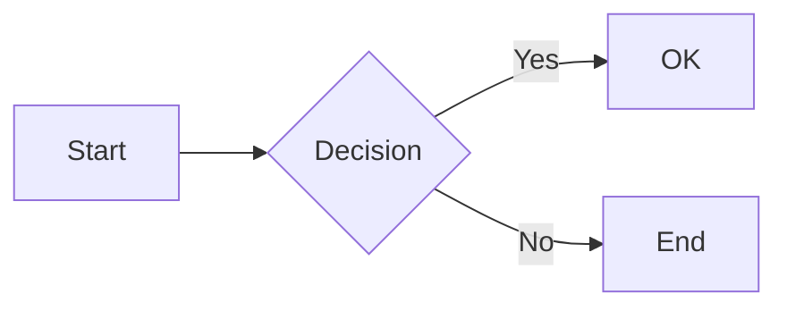

## Activation Contract

Create or work with Slidev presentations when:
- User asks to create slides, a presentation, or a slide deck
- User mentions slidev, sli.dev, or markdown-based presentations
- User wants to generate slides from a document or spec (e.g., `doc/presentacion_tfm.md`)
- User needs to export, build, or deploy a Slidev presentation

## Hard Rules

- The entry point is always `slides.md` unless otherwise specified.
- Each slide is separated by `---` on its own line.
- The first YAML frontmatter block is the **headmatter** (deck-level config). Subsequent frontmatter blocks are slide-level config.
- Presenter notes go as HTML comments `<!-- -->` at the **very end** of a slide, not in the middle.
- Use **Vue components** directly in Markdown — no imports needed (auto-registered from `components/`).
- UnoCSS utility classes work inline: `class="text-2xl p-4 bg-blue-100"`
- Icons use Iconify format: `<carbon:logo-github>` or `<uil:github>`.
- For the TFM presentation, use Spanish content (es-ES, neutral) in slides and notes.

## Decision Gates

| Need | Action |
|------|--------|
| Quick start | `pnpm create slidev` → edit `slides.md` → `pnpm dev` |
| Custom theme | Set `theme: seriph` or `theme: default` in headmatter. Install via `npm i @slidev/theme-*` |
| Vue components | Create `.vue` files in `components/` — auto-imported |
| Code animations | Use ` ```md magic-move` blocks with multiple code snippets |
| Click animations | `v-click` directive or `<v-clicks>` component |
| Diagrams | Mermaid fenced blocks with ` ```mermaid` |
| Math | LaTeX inline `$...$` or block `$$...$$` — KaTeX built-in |
| PDF export | `pnpm export` (requires playwright) |
| PPTX export | `pnpm export --format pptx` |
| SPA build | `pnpm build` → static `dist/` for hosting |
| GitHub Pages | Use `--base /repo-name/` and GitHub Actions workflow |

## Execution Steps

1. **Initialize**: `pnpm create slidev` (or `npm init slidev`) in the target directory
2. **Configure headmatter** in `slides.md`: theme, title, author, fonts, transitions, aspect ratio
3. **Write slides** in Markdown with `---` separators
4. **Add presenter notes** as `<!-- note text -->` at the end of each slide
5. **Preview**: `pnpm dev` — hot-reload at `http://localhost:3030`
6. **Add diagrams** with Mermaid, code highlighting with Shiki, animations with `v-click`
7. **Export**: `pnpm export` for PDF, `pnpm export --format pptx` for PowerPoint
8. **Build for deploy**: `pnpm build --base /path/`

## Output Contract

Return:
- Path to the `slides.md` file created/modified
- Key Slidev features used (themes, layouts, animations, diagrams)
- Build/export commands for the user to run
- Any custom components or layouts created under `components/` or `layouts/`

## Key Syntax Reference

```markdown
---
# Headmatter (deck-level)
theme: default
title: My Talk
aspectRatio: 16/9
transition: slide-left
fonts:
  sans: Roboto
  mono: Fira Code
drawings:
  enabled: true
---

# Slide 1 — Title

Content here
<!-- Presenter note -->

---
layout: center
class: text-2xl
---

# Slide 2 — Centered content

<div v-click>Appears on click</div>
<v-clicks>
  - Step 1
  - Step 2
</v-clicks>

---
layout: image
image: /photo.jpg
---

<!-- Full-bleed image slide -->

---

# Slide with code

```ts
console.log('Hello Slidev!')
```

---

# Slide with diagram



---

# Slide with LaTeX

When $a \ne 0$, there are two solutions to $ax^2 + bx + c = 0$

$$ x = {-b \pm \sqrt{b^2-4ac} \over 2a} $$
```

## References

- `references/core-headmatter.md` — Deck-level frontmatter options
- `references/core-cli.md` — CLI commands and options
- `doc/presentacion_tfm.md` — Content guide for the TFM presentation
- Official docs: [sli.dev](https://sli.dev)
- Theme gallery: [sli.dev/resources/theme-gallery](https://sli.dev/resources/theme-gallery)
- GitHub: [github.com/slidevjs/slidev](https://github.com/slidevjs/slidev)